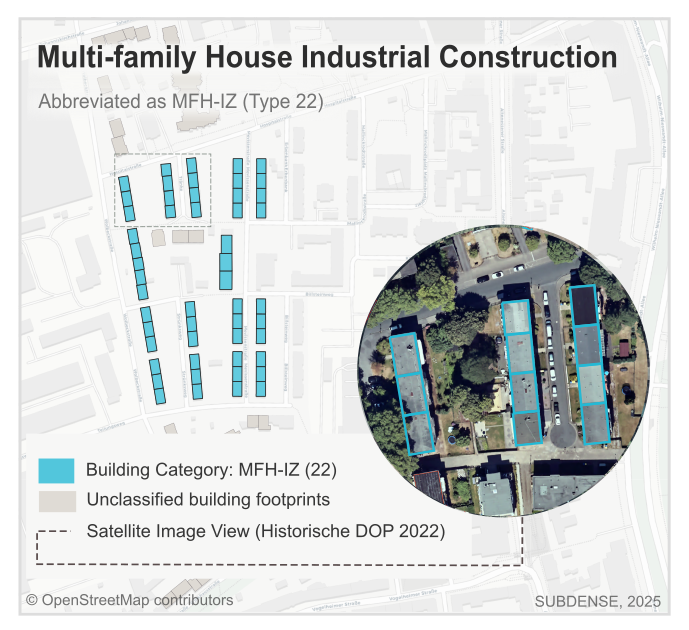

# Building Typology for Training Data Production

The training data was producted focusing on a defined set of building typologies. These typologies represent patterns and characteristics observed in various urban and rural settings in context to Germany. 

The following table summarizes the selected building typologies used for training data production. Click the links for description of each typology followed by an example map.

| Sr. No. | Typology                                                                 | Type | Code    |
|--------:|--------------------------------------------------------------------------|------|---------|
| 1       | [Detached Apartment Building](#1-detached-apartment-building)           | 12   | MFH-F   |
| 2       | [High-rise Apartment Building](#2-high-rise-apartment-building)         | 13   | MFH-HH  |
| 3       | [Apartment Building in the Historic Town Center](#3-apartment-building-in-the-historic-town-center) | 14   | MFH-H   |
| 4       | [Traditional Row Apartment Building](#4-traditional-row-apartment-building) | 21   | MFH-TZ  |
| 5       | [Multi-family House Industrial Construction](#5-multi-family-house-industrial-construction) | 22   | MFH-IZ  |
| 6       | [Multi-family House Block Development](#6-multi-family-house-block-development) | 23   | MFH-G   |
| 7       | [Single family House](#7-single-family-house)                           | 31   | EFH-EH  |
| 8       | [Terraced House](#8-terraced-house)                                     | 32   | EFH-RH  |
| 9       | [Rural House Form](#9-rural-house-form)                                 | 33   | LH      |
|10       | [Semi-detached House](#10-semi-detached-house)                          | 34   | EFH-DH  |
|11       | [Buildings for Business, Trade and Agriculture](#11-buildings-for-business-trade-and-agriculture) | 41   | WGL     |
|12       | [Outbuildings](#12-outbuildings)                                        | 99   | NG      |

&nbsp;

## 1. Detached Apartment Building 
#### Code MFH-F, Type 12
Small apartment building, not attached to adjacent structures. This building type is often difficult to distinguish from [Type 31](#7-single-family-house) due to similar size and form. However, certain indicators can assist in classification. Unlike Type 31, Type 12 typically lacks a surrounding garden area. The presence of multiple balconies and a significant number of parking spaces may also suggest this typology.

## 2. High-rise Apartment Building 
#### Code MFH-HH, Type 13
Standalone apartment building with more than 30m height.  
 

## 3. Apartment Building in the Historic Town Center
#### Code MFH-H, Type 14
These are old apartment buildings located in the historic part of the town. The buildings are built clustered together along narrow and winding streets with no proper structure. The buildings usually have red tile roofs and often no gardens or parking areas. Many are attached to each other and follow the shape of old street layouts. 

## 4. Traditional Row Apartment Building 
#### Code MFH-TZ, Type 21
Long, narrow apartment buildings with more than one entrance, arranged in rows with regular spacing. The layout is open, with green spaces or courtyards between the buildings. Parking is often located along the streets or in nearby lots.

## 5. Multi-family House Industrial Construction
#### Code MFH-IZ, Type 22
Apartment buildings built during the post-war period as part of industrial housing peroid. They have a simple, functional design with flat or low-pitched roofs. Buildings are long, with multiple entrances, and arranged in a regular grid. There are large green spaces between the blocks, often used as communal areas.

## 6. Multi-family House Block Development
#### Code MFH-G, Type 23
This type of buildings form a closed or semi-closed block, often connected to each other. The layout follows the traditional “Blockrandbebauung” (perimeter block development) seen in many German cities. The inner courtyard is usually shared and used for green space, parking, or small gardens.

## 7. Single-family House
#### Code EFH-EH, Type 31
A small standalone residential building, typically surrounded by a private garden. It often includes an attached garage. When annotating this type, only the main residential structure should be labeled as Type 31. Additional structures such as garages, sheds, or other outbuildings should be classified separately as [Type 99](#12-Outbuildings).
 

## 8. Terraced House
#### Code EFH-RH, Type 32
Single-family homes that are built directly next to one another, sharing side walls. Each unit has its own entrance from street level. Typically, each house also includes a private garden, which is often visible in aerial imagery.
  

## 9. Rural House Form
#### Code LH, Type 33
This building type is typically found in rural or countryside and consists of multiple freestanding structures. One building serves as the main residential unit, while the others are used for agricultural or utility purposes, such as barn or storage units. The buildings are usually situated within or adjacent to farmland, reflecting traditional rural settlement patterns in Germany. The buildings often feature pitched roofs.

## 10. Semi-detached House 
#### Code EFH-DH, Type 34
This typology consists of two single-family homes built together as a pair, usually sharing one common wall. Each unit typically includes an separate entrance and a garden area.
 

## 11. Buildings for Business, Trade and Agriculture
#### Code WGL, Type 41
  

## 12. Outbuildings
#### Code NG, Type 99
Outbuildings are small secondary structures attached to or next to the main building. They are typically used as garages, storage units, or utility spaces. Outbuildings are often single-story and have a simple rectangular footprint with flat roof. They are not used for living purposes but support the main residential or commercial function of the adjacent building.

